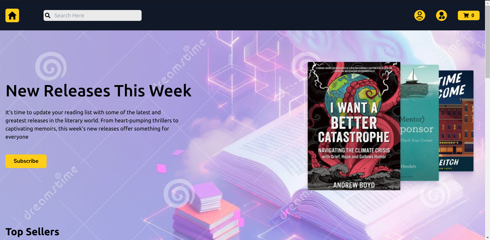
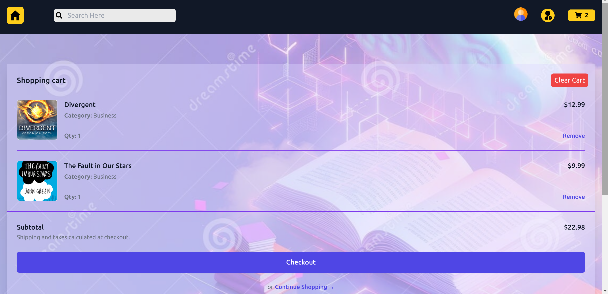
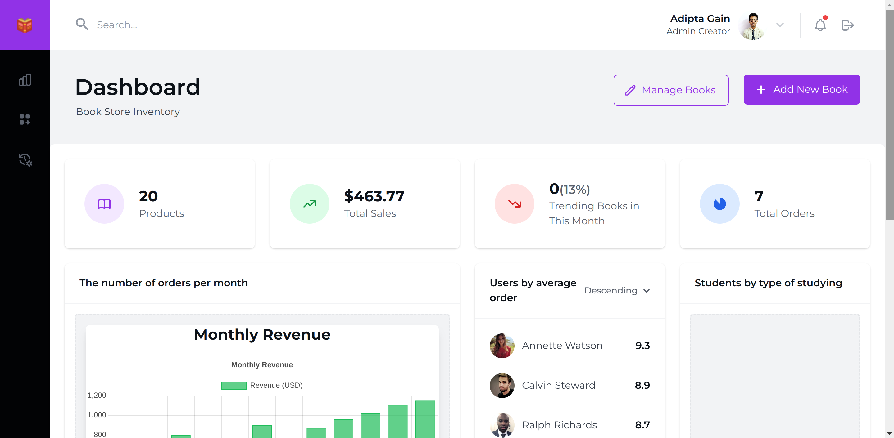
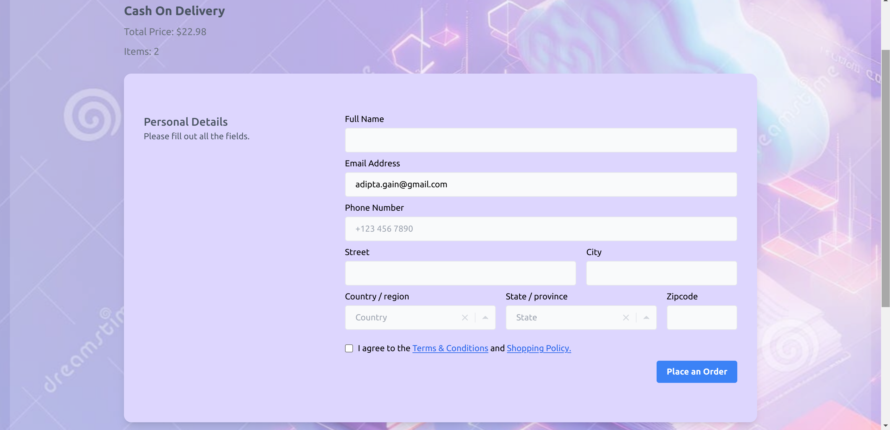

# 📚 Bookstore Library E-commerce

A full-stack e-commerce web application built using the **MERN stack** (MongoDB, Express.js, React.js, Node.js) that allows users to browse, search, and purchase books online. Admins can manage inventory, users, and orders through a dedicated dashboard.

---

## 🚀 Features

### 👤 User Features
- Browse and search for books
- View detailed book descriptions
- Add books to cart and manage cart
- Secure checkout process and payment gateway
- View order history
- User authentication and profile management

### 🛠️ Admin Features
- Add, update, or delete books
- Manage user accounts
- Track and manage orders
- Dashboard with sales insights

---

## 🛠️ Tech Stack

**Frontend**
- React.js
- React Router
- Redux Toolkit
- Tailwind CSS / Bootstrap / CSS Modules

**Backend**
- Node.js
- Express.js
- MongoDB + Mongoose

**Authentication**
- JSON Web Tokens (JWT)
- bcrypt for password hashing

**Payments**
- Razorpay integration

---

## 🖼️ Screenshots

### 🏠 Homepage

### 🛒 Cart Page

### 🛠️ Admin Page

### 💳 Checkout Page

